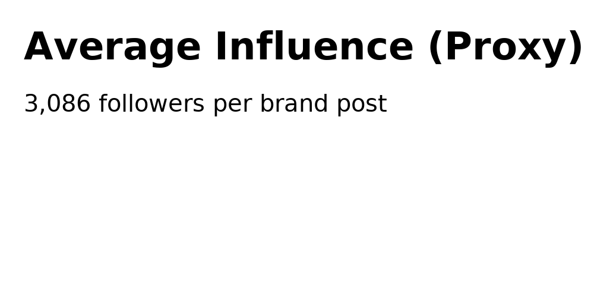
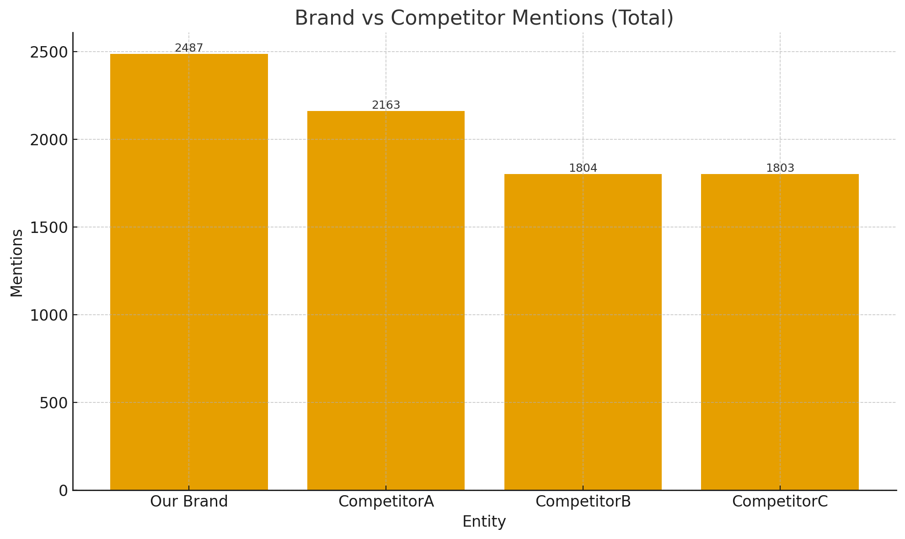
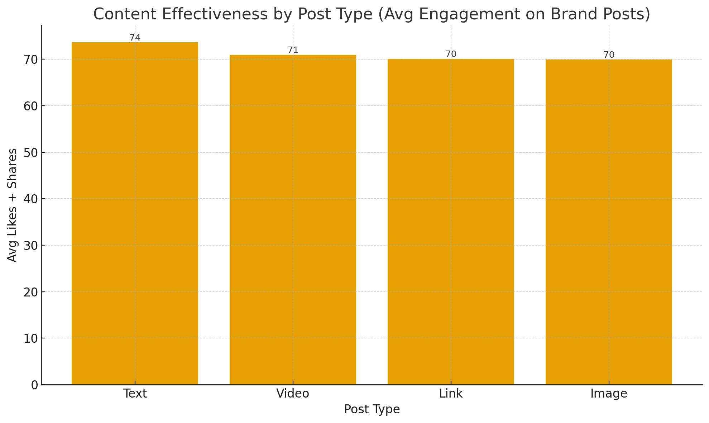
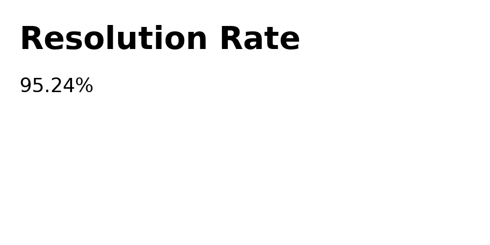
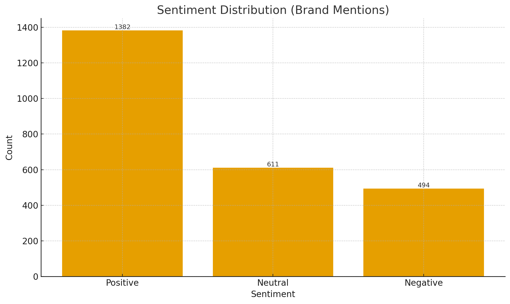

# Enhancing-Brand-Recognition-Through-Effective-Social-Media-Monitoring
Analysis of how 1 company leverages it's social media marketing tools to manage and enhance brand recognition. 

# Brand Reputation Management: Data Analytics Project  

## Table of Contents
- [Introduction](#introduction)  
- [Business Problem](#business-problem)  
- [Data Sources](#data-sources)  
- [Key Metrics and Visualizations](#key-metrics-and-visualizations)  
  - [Average Crisis Response Time](#average-crisis-response-time)  
  - [Average Influence Score](#average-influence-score)  
  - [Brand vs Competitor Mentions](#brand-vs-competitor-mentions)  
  - [Content Effectiveness](#content-effectiveness)  
  - [Engagement Rate](#engagement-rate)  
  - [Resolution Rate](#resolution-rate)  
  - [Sentiment Analysis](#sentiment-analysis)  
- [SQL Code Samples](#sql-code-samples)  
- [Demo Dashboard SQL Report](#demo-dashboard-sql-report)  
- [Insights & Recommendations](#insights--recommendations)  
- [Conclusion](#conclusion)  

---

## Introduction
AfriTech Electronics Ltd. has faced growing **brand reputation challenges** caused by negative customer reviews, product recalls, and competitor pressure. This project leverages **PostgreSQL** and **social media analytics** to uncover insights that can guide AfriTech in improving its brand perception, customer trust, and market competitiveness.

---

## Business Problem
AfriTech’s challenges include:  
- Rising **negative social media buzz** damaging brand image.  
- Escalating **customer complaints** about defects and support delays.  
- Frequent **product recalls** leading to public relations crises.  
- **Competitive pressure** from rivals capitalizing on weaknesses.  

The goal is to use **data-driven analysis** to restore reputation and enhance customer trust.

---

## Data Sources
Data was ingested into **PostgreSQL** from transaction logs, customer records, and social media monitoring. The schema included:  
- **CustomerData** (demographics, segmentation)  
- **Transactions** (sales, product recalls)  
- **SocialMedia** (brand mentions, sentiment, engagement, influencer metrics, crisis events)  

---

## Key Metrics and Visualizations  

### Average Crisis Response Time  
.png)  
- **Result:** 9.34 hours on average to respond to crises.  
- **Implication:** The company is slower than the ideal **< 6 hours** benchmark, risking escalation.  

```sql
SELECT AVG(DATE_PART('epoch', (CAST(FirstResponseTime AS TIMESTAMP) 
         - CAST(CrisisEventTime AS TIMESTAMP))) / 3600) AS AverageResponseTimeHours
FROM SocialMedia
WHERE CrisisEventTime IS NOT NULL AND FirstResponseTime IS NOT NULL;
```

---

### Average Influence Score  
  
- **Result:** 3,086 average followers per brand-related post.  
- **Implication:** AfriTech has **strong reach potential**, but must focus on converting reach into positive advocacy.  

```sql
SELECT AVG(InfluencerScore) AS AverageInfluenceScore
FROM SocialMedia;
```

---

### Brand vs Competitor Mentions  
  
- **Result:** AfriTech leads in mentions (2,487), followed by Competitor A (2,163).  
- **Implication:** High visibility but **brand narrative control is at risk** — mentions can skew negative.  

```sql
SELECT
  SUM(CASE WHEN BrandMention = TRUE THEN 1 ELSE 0 END) AS BrandMentions,
  SUM(CASE WHEN CompetitorMention = TRUE THEN 1 ELSE 0 END) AS CompetitorMentions
FROM SocialMedia;
```

---

### Content Effectiveness  
  
- **Result:** Text posts had the highest engagement (74 avg likes+shares), followed by video and image.  
- **Implication:** **Content strategy should prioritize text posts** (e.g., product announcements, direct customer updates).  

```sql
SELECT PostType, AVG(EngagementLikes + EngagementShares + EngagementComments) AS Engagement
FROM SocialMedia
GROUP BY PostType;
```

---

### Engagement Rate  
  
- **Result:** 3.78% average engagement rate per post.  
- **Implication:** Slightly above the **industry benchmark (~3%)**, suggesting active but not maximized community engagement.  

```sql
SELECT AVG((EngagementLikes + EngagementShares + EngagementComments) / 
            NULLIF(UserFollowers, 0)) AS EngagementRate
FROM SocialMedia;
```

---

### Resolution Rate  
  
- **Result:** 95.24% of crises resolved.  
- **Implication:** AfriTech’s crisis **completion rate is strong**, but improvements in **response speed** are required.  

```sql
SELECT COUNT(*) * 100.0 / (SELECT COUNT(*) 
                           FROM SocialMedia 
                           WHERE CrisisEventTime IS NOT NULL) AS ResolutionRate
FROM SocialMedia
WHERE ResolutionStatus = TRUE;
```

---

### Sentiment Analysis  
  
  
- **Result:**  
  - 55.6% Positive  
  - 24.6% Neutral  
  - 19.9% Negative  
- **Implication:** While **positive sentiment dominates**, nearly **1 in 5 mentions are negative**, posing a brand risk.  

```sql
SELECT Sentiment, COUNT(*) * 100.0 / (SELECT COUNT(*) FROM SocialMedia) AS Percentage
FROM SocialMedia
GROUP BY Sentiment;
```

---

## SQL Code Samples  
The project relied heavily on **PostgreSQL queries** for analysis, data transformation, and visualization preparation. Full SQL queries for ETL, validation, and advanced analytics are available in the [`Brand Reputation.sql`](Brand_Reputation.sql) file.  

---

## Demo Dashboard SQL Report  

To generate all KPIs in a single view for executives:  

```sql
WITH Metrics AS (
    SELECT 
        AVG((EngagementLikes + EngagementShares + EngagementComments) / NULLIF(UserFollowers, 0)) AS EngagementRate,
        AVG(InfluencerScore) AS AvgInfluenceScore,
        AVG(DATE_PART('epoch', (FirstResponseTime - CrisisEventTime)) / 3600) AS AvgCrisisResponseTime,
        COUNT(*) * 100.0 / (SELECT COUNT(*) FROM SocialMedia WHERE CrisisEventTime IS NOT NULL) AS ResolutionRate
    FROM SocialMedia
    WHERE UserFollowers IS NOT NULL
),
SentimentData AS (
    SELECT Sentiment, COUNT(*) * 100.0 / (SELECT COUNT(*) FROM SocialMedia) AS SentimentPct
    FROM SocialMedia
    GROUP BY Sentiment
),
BrandVsCompetitors AS (
    SELECT 
        SUM(CASE WHEN BrandMention = TRUE THEN 1 ELSE 0 END) AS BrandMentions,
        SUM(CASE WHEN CompetitorMention = TRUE THEN 1 ELSE 0 END) AS CompetitorMentions
    FROM SocialMedia
)
SELECT * FROM Metrics, BrandVsCompetitors;

SELECT * FROM SentimentData;
```

---

## Insights & Recommendations  

1. **Reduce Crisis Response Time** – Implement AI-powered chatbots and crisis alert dashboards to reduce from **9.34h → <6h**.  
2. **Amplify Influencers** – Partner with high-influence advocates to boost positive messaging.  
3. **Content Strategy Shift** – Prioritize **text posts** with strong calls-to-action while keeping video for high-value launches.  
4. **Sentiment Intervention** – Deploy **predictive sentiment alerts** to prevent negative buzz spikes.  
5. **Competitor Benchmarking** – Use comparative mentions to identify where AfriTech loses ground and craft targeted campaigns.  

---

## Conclusion  
AfriTech Electronics has strong visibility and influence but faces risks in **crisis speed** and **negative buzz control**. By improving **real-time monitoring**, **content strategy**, and **crisis management systems**, the company can rebuild customer trust and transform reputation into a competitive advantage.  
